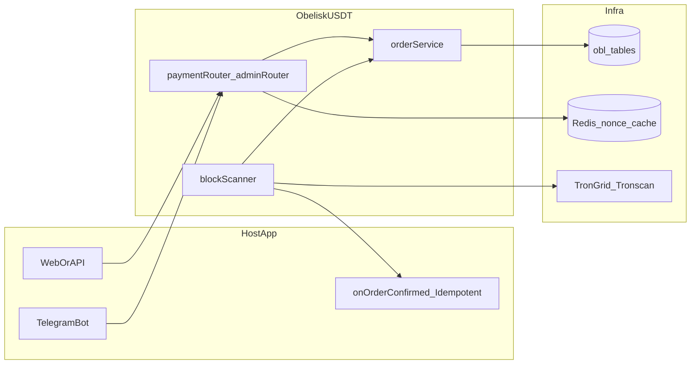
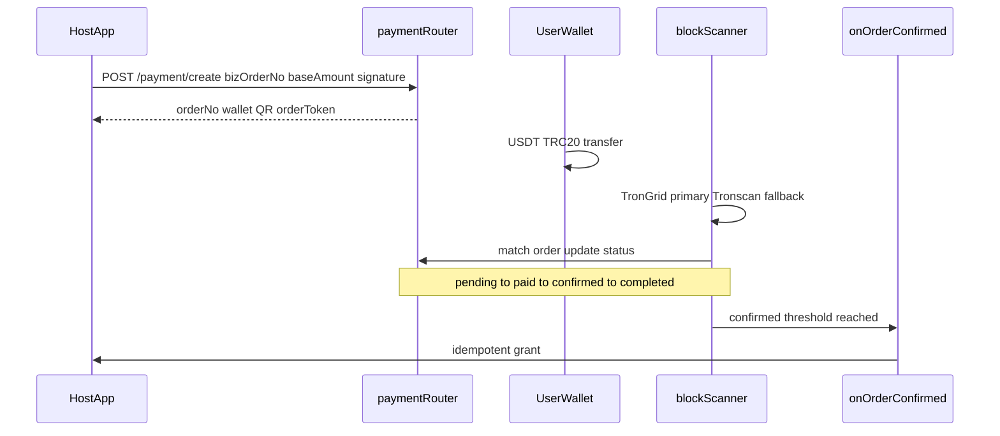
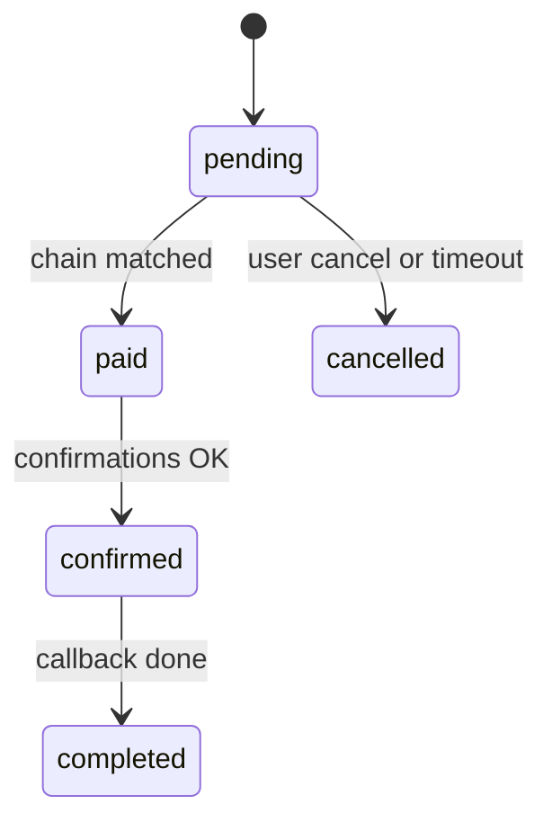

<p align="center">
  <a href="README.md"></a>
  <a href="README.en.md"></a>
</p>

<div align="center">


<br />

### Embeddable USDT-TRC20 payment module

*Self-hosted payment pipeline for web and Telegram — funds go to your wallets.*

<br />

[](https://www.npmjs.com/package/@obeliskstudio/obelisk-usdt) [](LICENSE) [](https://nodejs.org/) [](https://tron.network/) [](#overview)

<br />

[](https://github.com/Olleigeigei/ObeliskUsdt/stargazers) [](https://github.com/Olleigeigei/ObeliskUsdt/network/members) [](https://github.com/Olleigeigei/ObeliskUsdt/commits/master)

<br />

[](https://t.me/okgeceo) [](https://t.me/ObeliskStudio) [](https://www.npmjs.com/package/@obeliskstudio/obelisk-usdt)

</div>

---

## Table of contents

- [Overview](#overview)
- [Tech stack](#tech-stack)
- [Architecture](#architecture)
- [Scope](#scope)
- [Features](#features)
- [Quick start](#quick-start)
- [Payment flow](#payment-flow)
- [Order lifecycle](#order-lifecycle)
- [HTTP API](#http-api)
- [Environment](#environment)
- [Create order & signing](#create-and-sign)
- [Security & reliability](#security-and-reliability)
- [Examples & docs](#examples-and-docs)
- [Pre-launch checklist](#pre-launch)
- [License & contact](#license-and-contact)

> Full integration guide (Chinese): **[docs/使用说明-接入文档.md](docs/使用说明-接入文档.md)** · Simplified Chinese README: **[README.md](README.md)**

---

<a id="overview"></a>

## Overview

**ObeliskUSDT** is a **USDT-TRC20** payment module: create orders, QR codes, on-chain scanning, and `onOrderConfirmed` callbacks.  
It is **not** a storefront — it embeds into your app; catalog, pricing, and entitlements stay in the host.

| | |
|------|------|
| Goal | Low-friction integration; payment decoupled from business logic |
| Use cases | Websites, Telegram bots, SaaS, subscriptions, paid tools |
| Reconciliation | Pass through `bizOrderNo`; payment `orderNo` is separate |
| Deployment | Self-hosted; funds land in **your** wallets |

The npm package ships compiled **JavaScript** without `.d.ts`. TypeScript hosts can add `declare module '@obeliskstudio/obelisk-usdt'`.

---

<a id="tech-stack"></a>

## Tech stack

<div align="center">

[](https://nodejs.org/)
[](https://expressjs.com/)
[](https://redis.io/)
[](https://www.mysql.com/)
[](https://www.postgresql.org/)
[](https://www.sqlite.org/)
[](https://sequelize.org/)
[](examples/backend/prisma-persistence.example.ts)
[](https://developers.tron.network/)

</div>

Persistence: either pass **`sequelize`** (built-in) or a custom **`persistence`** implementing `ObeliskPersistence` (e.g. Prisma).

---

<a id="architecture"></a>

## Architecture



---

<a id="scope"></a>

## Scope

| Module | Host app |
|--------|----------|
| Payment orders and payable amounts | Products, pricing, inventory |
| Wallet assignment and QR codes | Entitlements (**must be idempotent**) |
| Chain matching and status updates | Users and authorization |
| `onOrderConfirmed` callback | Finance and internal reporting |

Tables use prefix **`obl_`**: `obl_payment_wallets`, `obl_payment_orders`, `obl_payment_transactions`.

---

<a id="features"></a>

## Features

| | |
|---|------|
|  | HTTP routes; no framework lock-in |
|  | Deploy on your infra; auditable flow |
|  | One core for web and bot |
|  | Tx hash dedup |
|  | Status/cancel scoped by `orderToken` |
|  | HMAC on create + `ts`/`nonce` anti-replay |

---

<a id="quick-start"></a>

## Quick start

### Install

```bash
npm i @obeliskstudio/obelisk-usdt@latest
npm ls @obeliskstudio/obelisk-usdt
```

### Checklist

- [ ] Run DB migrations (`runObeliskUSDTMigrations`)
- [ ] `initObeliskUSDT(...)` and mount `paymentRouter` / `adminRouter`
- [ ] `startScanner()` + `registerScheduledTasks(cron)`
- [ ] Idempotent `onOrderConfirmed`
- [ ] Add **at least 2** receiving wallets in admin before going live

### Migrations

```ts
import { runObeliskUSDTMigrations, initObeliskUSDT } from '@obeliskstudio/obelisk-usdt';

await runObeliskUSDTMigrations({ sequelize, logger });
// or runObeliskUSDTMigrations({ query: myQueryFn, logger });
```

- Migration table: `obl_usdt_schema_migrations`; applied scripts are skipped  
- **`initObeliskUSDT` does not migrate** — run migrations in your deploy step

### Initialize

```ts
const usdt = initObeliskUSDT({
  sequelize, // or persistence: createPrismaObeliskPersistence(prisma)
  redis,
  logger,
  config: {
    network: 'mainnet',
    webUrl: process.env.WEB_URL || '',
    botUsername: process.env.BOT_USERNAME || '',
    trongridApiKey: process.env.TRONGRID_API_KEY,
    tronscanApiKey: process.env.TRONSCAN_API_KEY,
    apiAuthToken: process.env.OBL_USDT_API_AUTH_TOKEN || '',
  },
  authMiddleware: {
    optional: optionalAuth,
    required: requireAuth,
    admin: requireAdminAuth,
  },
  onOrderConfirmed: async (order) => {
    await benefitService.grantByOrderNo(order.orderNo); // idempotent
  },
});

app.use('/api', usdt.paymentRouter);
app.use('/api', usdt.adminRouter);
await usdt.startScanner();
usdt.registerScheduledTasks(cron);
```

---

<a id="payment-flow"></a>

## Payment flow



---

<a id="order-lifecycle"></a>

## Order lifecycle



| Status | Meaning |
|--------|---------|
| `pending` | Awaiting payment |
| `paid` | Matched on chain |
| `confirmed` | Confirmations OK |
| `completed` | Callback finished |

---

<a id="http-api"></a>

## HTTP API

### User routes

| Method | Path | Notes |
|--------|------|-------|
| `POST` | `/payment/create` | HMAC signature required |
| `GET` | `/payment/status/:orderNo` | Requires `orderToken` |
| `POST` | `/payment/cancel/:orderNo` | Requires `orderToken` |

`orderToken`: header `x-obl-order-token` or query `?token=`

### Admin routes

| Prefix | Notes |
|--------|-------|
| `/admin/payment/wallets/*` | Wallet CRUD |
| `/admin/payment/orders/*` | Order management |
| `/admin/payment/network*` | Network / scanner config |
| `GET /admin/payment/stats` | Scanner health (circuit breaker, queue) |

---

<a id="environment"></a>

## Environment

| Variable | Purpose |
|----------|---------|
| `TRONGRID_API_KEY` | TronGrid (primary) |
| `TRONSCAN_API_KEY` | Tronscan fallback (separate key) |
| `OBL_USDT_API_AUTH_TOKEN` | HMAC secret for create |
| `WEB_URL` | Web base URL |
| `BOT_USERNAME` | Bot username (bot scenarios) |

Never hardcode secrets. Status/cancel must verify order ownership.

---

<a id="create-and-sign"></a>

## Create order & signing

### Request body

```json
{
  "bizOrderNo": "HOST-ORDER-10001",
  "baseAmount": "99.00",
  "ts": 1700000000,
  "nonce": "e1b4f0f3b7d24e62a3d6c9f78b7a4b12",
  "metadata": { "biz": "obeliskcard", "plan": "vip_year" },
  "signature": "<hmac_hex_lowercase>"
}
```

### Fields

| Field | Required | Notes |
|-------|----------|-------|
| `bizOrderNo` | yes | Host order id; idempotent while pending and not expired |
| `baseAmount` | yes | > 0, max 2 decimals, string recommended |
| `ts` | yes | Seconds or ms; default skew 300s (`apiSignMaxSkewSeconds`) |
| `nonce` | yes | Redis `SET NX` per `bizOrderNo+nonce` |
| `metadata` | no | Included in signature (stable JSON) |
| `signature` | yes | HMAC-SHA256 hex lowercase |

### Signing (summary)

1. Fields: `bizOrderNo`, `baseAmount`, `ts`, `nonce`, `metadata` (skip if empty)  
2. Sort keys ASCII; join `key=encodeURIComponent(value)&...`  
3. `stableStringify` metadata before encoding  
4. HMAC-SHA256; compare with `timingSafeEqual`

Details: **[docs/使用说明-接入文档.md](docs/使用说明-接入文档.md)** §6, §6.1 (Chinese).

<details>
<summary><strong>Node.js signing example</strong></summary>

```ts
import crypto from 'crypto';

function stableStringify(value: any): string {
  if (value === null || value === undefined) return '';
  if (typeof value === 'string') return JSON.stringify(value);
  if (typeof value === 'number') return JSON.stringify(Number.isFinite(value) ? value : null);
  if (typeof value === 'boolean') return JSON.stringify(value);
  if (Array.isArray(value)) return `[${value.map((v) => stableStringify(v)).join(',')}]`;
  if (typeof value === 'object') {
    const keys = Object.keys(value).sort();
    return `{${keys.map((k) => `${JSON.stringify(k)}:${stableStringify(value[k])}`).join(',')}}`;
  }
  return JSON.stringify(String(value));
}

export function buildSignature(payload: any, apiAuthToken: string) {
  const picked: Record<string, string> = {};
  const fields = ['bizOrderNo', 'baseAmount', 'ts', 'nonce'];
  for (const f of fields) {
    const v = payload?.[f];
    const s = v === undefined || v === null ? '' : String(v).trim();
    if (s) picked[f] = s;
  }
  if (payload?.metadata && typeof payload.metadata === 'object') {
    const raw = stableStringify(payload.metadata);
    if (raw && raw !== '{}' && raw !== '[]') picked.metadata = raw;
  }

  const canonical = Object.keys(picked)
    .sort()
    .map((k) => `${k}=${encodeURIComponent(picked[k])}`)
    .join('&');

  return crypto.createHmac('sha256', apiAuthToken).update(canonical).digest('hex');
}
```

</details>

### Web & bot

- **Web**: show QR and countdown; poll `GET /payment/status/:orderNo`  
- **Bot**: `usdt.bot.createOrderWithQR({ bizOrderNo, baseAmount, metadata })` → `qrPngBuffer`

---

<a id="security-and-reliability"></a>

## Security & reliability

| Topic | Notes |
|-------|-------|
| Chain data | TronGrid first; **valid array (even empty) stops**; Tronscan only on failure/invalid body |
| API keys | Separate keys for TronGrid and Tronscan |
| Circuit breaker | Short backoff on upstream failures |
| Scanner | Wallet pool, config cache, slower polling when idle |
| Callbacks | Async queue after confirm (retry + DLQ) |

---

<a id="examples-and-docs"></a>

## Examples & docs

| Path | Notes |
|------|-------|
| [examples/backend/host-init.ts](examples/backend/host-init.ts) | Host init and routes |
| [examples/backend/prisma-persistence.example.ts](examples/backend/prisma-persistence.example.ts) | Prisma persistence |
| [examples/backend/payment-api-client.ts](examples/backend/payment-api-client.ts) | Create / query / cancel |
| [examples/web/create-and-poll.ts](examples/web/create-and-poll.ts) | Web polling |
| [examples/bot/create-order-with-qr.ts](examples/bot/create-order-with-qr.ts) | Bot QR order |
| [docs/使用说明-接入文档.md](docs/使用说明-接入文档.md) | Full integration (Chinese) |

---

<a id="pre-launch"></a>

## Pre-launch checklist

- [ ] ≥ 2 active receiving wallets  
- [ ] Idempotent `onOrderConfirmed`  
- [ ] Scanner and cron running and observable  
- [ ] `.env`: TronGrid, Tronscan, `apiAuthToken`  
- [ ] Status/cancel always use `orderToken`  

---

<a id="license-and-contact"></a>

## License & contact

<div align="center">

[](LICENSE)
[](https://t.me/okgeceo)

</div>

Copyright © 2026 ObeliskStudio. All rights reserved.

- Maintainer: `@okgeceo` (ObeliskStudio) · Studio TG: `@ObeliskStudio`  
- Email: `okgeceo@gmail.com`  
- Custom payments, bots, and web work: **`@okgeceo`**
