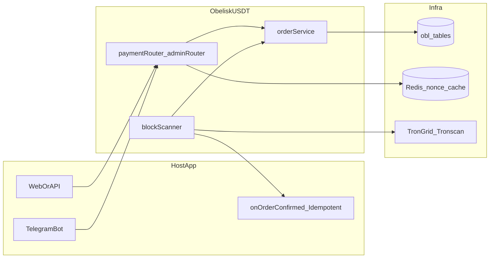
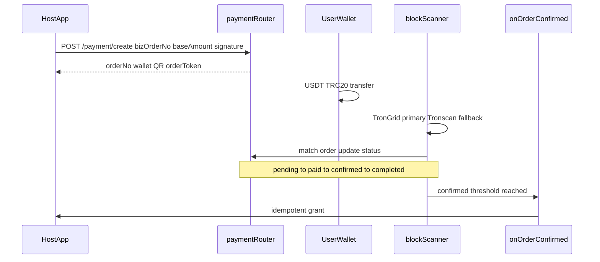
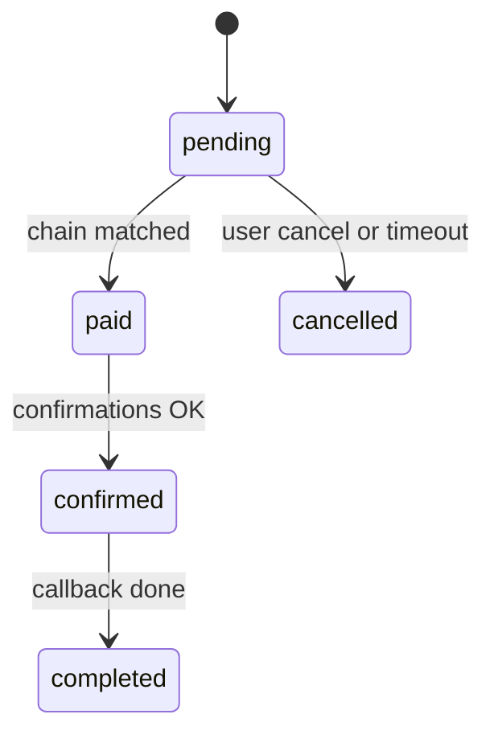

<div align="center">


<br />

### 可嵌入的 USDT-TRC20 支付模块 · Embeddable USDT payment module

*Self-hosted payment pipeline for web and Telegram — funds go to your wallets.*

<br />

[](https://www.npmjs.com/package/@obeliskstudio/obelisk-usdt) [](LICENSE) [](https://nodejs.org/) [](https://tron.network/) [](#overview)

<br />

[](https://github.com/Olleigeigei/ObeliskUsdt/stargazers) [](https://github.com/Olleigeigei/ObeliskUsdt/network/members) [](https://github.com/Olleigeigei/ObeliskUsdt/commits/master)

<br />

[](https://t.me/okgeceo) [](https://t.me/ObeliskStudio) [](https://www.npmjs.com/package/@obeliskstudio/obelisk-usdt)

</div>

---

## 目录 · Table of Contents

- [概览 / Overview](#overview)
- [技术栈 / Tech Stack](#tech-stack)
- [架构一览 / Architecture](#architecture)
- [职责边界 / Scope](#scope)
- [核心特性 / Features](#features)
- [快速开始 / Quick Start](#quick-start)
- [支付时序 / Payment Flow](#payment-flow)
- [订单状态 / Order Lifecycle](#order-lifecycle)
- [HTTP 接口 / API](#http-api)
- [环境变量 / Environment](#environment)
- [创建订单与签名 / Create & Sign](#create-and-sign)
- [安全与稳定性 / Security & Reliability](#security-and-reliability)
- [示例与文档 / Examples & Docs](#examples-and-docs)
- [上线检查 / Pre-launch](#pre-launch)
- [许可与联系 / License & Contact](#license-and-contact)

---

<a id="overview"></a>

## 概览 / Overview

`ObeliskUSDT` 专注 **USDT-TRC20** 收款：下单、二维码、扫链确认、`onOrderConfirmed` 回调。  
**不是商城系统**，而是可嵌入宿主项目的支付模块；商品、定价、会员发放由宿主负责。

| 维度 | 说明 |
|------|------|
| 目标 | 低改造、快接入、支付与业务解耦 |
| 适用 | 网站、Telegram 机器人、SaaS、订阅与工具付费 |
| 对账 | `bizOrderNo` 透传，区分业务单号与支付 `orderNo` |
| 部署 | 私有化自托管，资金直达你的收款钱包 |

npm 包为编译后的 **JavaScript**，不含 `.d.ts`；TypeScript 宿主可自行 `declare module '@obeliskstudio/obelisk-usdt'`。

---

<a id="tech-stack"></a>

## 技术栈 / Tech Stack

<div align="center">

[](https://nodejs.org/)
[](https://expressjs.com/)
[](https://redis.io/)
[](https://www.mysql.com/)
[](https://www.postgresql.org/)
[](https://www.sqlite.org/)
[](https://sequelize.org/)
[](examples/backend/prisma-persistence.example.ts)
[](https://developers.tron.network/)

</div>

数据访问二选一：`sequelize`（内置实现）或自定义 `persistence`（`ObeliskPersistence`，如 Prisma）。

---

<a id="architecture"></a>

## 架构一览 / Architecture



---

<a id="scope"></a>

## 职责边界 / Scope

| 本模块负责 | 宿主项目负责 |
|------------|--------------|
| 生成支付订单与实付金额 | 商品、定价、库存等业务规则 |
| 分配收款钱包与支付二维码 | 权益发放（**必须幂等**） |
| 扫链匹配、更新支付状态 | 用户系统与权限体系 |
| 触发 `onOrderConfirmed` | 财务对账与内部报表 |

核心表前缀 **`obl_`**：`obl_payment_wallets`、`obl_payment_orders`、`obl_payment_transactions`。

---

<a id="features"></a>

## 核心特性 / Features

| | 能力 |
|---|------|
|  | HTTP 路由接入，不绑定业务框架 |
|  | 部署在你自己的环境，链路可审计 |
|  | 网页与机器人共用一套支付核心 |
|  | 交易哈希去重，避免重复入账 |
|  | 查询/取消校验订单归属 |
|  | 创建订单签名 + `ts`/`nonce` 防重放 |

---

<a id="quick-start"></a>

## 快速开始 / Quick Start

### 安装 / Install

```bash
npm i @obeliskstudio/obelisk-usdt@latest
npm ls @obeliskstudio/obelisk-usdt
```

### 5 分钟清单 / Checklist

- [ ] 执行数据库迁移（推荐 `runObeliskUSDTMigrations`）
- [ ] `initObeliskUSDT(...)` 并挂载 `paymentRouter` / `adminRouter`
- [ ] `startScanner()` + `registerScheduledTasks(cron)`
- [ ] 实现幂等 `onOrderConfirmed`
- [ ] 管理端先添加 **至少 2 个** 收款钱包再开放支付

### 迁移 / Migrations

```ts
import { runObeliskUSDTMigrations, initObeliskUSDT } from '@obeliskstudio/obelisk-usdt';

await runObeliskUSDTMigrations({ sequelize, logger });
// 或 runObeliskUSDTMigrations({ query: myQueryFn, logger });  // 与 sequelize 二选一
```

- 迁移记录表：`obl_usdt_schema_migrations`；已执行脚本自动跳过  
- **`initObeliskUSDT` 不会自动改库**，需在部署阶段主动跑迁移

### 初始化 / Initialize

```ts
const usdt = initObeliskUSDT({
  sequelize, // 或 persistence: createPrismaObeliskPersistence(prisma)
  redis,
  logger,
  config: {
    network: 'mainnet',
    webUrl: process.env.WEB_URL || '',
    botUsername: process.env.BOT_USERNAME || '',
    trongridApiKey: process.env.TRONGRID_API_KEY,
    tronscanApiKey: process.env.TRONSCAN_API_KEY,
    apiAuthToken: process.env.OBL_USDT_API_AUTH_TOKEN || '',
  },
  authMiddleware: {
    optional: optionalAuth,
    required: requireAuth,
    admin: requireAdminAuth,
  },
  onOrderConfirmed: async (order) => {
    await benefitService.grantByOrderNo(order.orderNo); // 必须幂等
  },
});

app.use('/api', usdt.paymentRouter);
app.use('/api', usdt.adminRouter);
await usdt.startScanner();
usdt.registerScheduledTasks(cron);
```

---

<a id="payment-flow"></a>

## 支付时序 / Payment Flow



---

<a id="order-lifecycle"></a>

## 订单状态 / Order Lifecycle



| 状态 | 含义 |
|------|------|
| `pending` | 待支付 |
| `paid` | 链上已匹配 |
| `confirmed` | 确认数达标 |
| `completed` | 回调处理完成 |

---

<a id="http-api"></a>

## HTTP 接口 / API

### 用户接口

| 方法 | 路径 | 说明 |
|------|------|------|
| `POST` | `/payment/create` | 创建订单；需 HMAC 签名 |
| `GET` | `/payment/status/:orderNo` | 查询状态；需 `orderToken` |
| `POST` | `/payment/cancel/:orderNo` | 取消订单；需 `orderToken` |

`orderToken`：Header `x-obl-order-token` 或 Query `?token=`

### 管理接口

| 前缀 | 说明 |
|------|------|
| `/admin/payment/wallets/*` | 收款钱包 CRUD |
| `/admin/payment/orders/*` | 订单管理 |
| `/admin/payment/network*` | 网络与扫描相关配置 |
| `GET /admin/payment/stats` | 扫描器健康（熔断、队列） |

---

<a id="environment"></a>

## 环境变量 / Environment

| 变量 | 用途 |
|------|------|
| `TRONGRID_API_KEY` | TronGrid 链上查询（主数据源） |
| `TRONSCAN_API_KEY` | Tronscan 回退查询（独立 Key） |
| `OBL_USDT_API_AUTH_TOKEN` | 创建订单 HMAC 密钥 |
| `WEB_URL` | 支付页/回调相关 Web 基址 |
| `BOT_USERNAME` | 机器人用户名（机器人场景） |

密钥禁止硬编码；查询/取消必须校验订单归属。

---

<a id="create-and-sign"></a>

## 创建订单与签名 / Create & Sign

### 请求体示例

```json
{
  "bizOrderNo": "HOST-ORDER-10001",
  "baseAmount": "99.00",
  "ts": 1700000000,
  "nonce": "e1b4f0f3b7d24e62a3d6c9f78b7a4b12",
  "metadata": { "biz": "obeliskcard", "plan": "vip_year" },
  "signature": "<hmac_hex_lowercase>"
}
```

### 字段说明

| 字段 | 必填 | 说明 |
|------|------|------|
| `bizOrderNo` | 是 | 宿主业务订单号；支付中且未过期时幂等返回同一笔 |
| `baseAmount` | 是 | 基准金额，> 0，最多 2 位小数，建议字符串 |
| `ts` | 是 | 时间戳（秒或毫秒）；默认窗口 300s，可配 `apiSignMaxSkewSeconds` |
| `nonce` | 是 | 随机串；Redis `SET NX` 按 `bizOrderNo+nonce` 防重放 |
| `metadata` | 否 | 透传字段，参与签名（稳定 JSON 序列化） |
| `signature` | 是 | HMAC-SHA256，`apiAuthToken` 为密钥，hex 小写 |

### 签名步骤摘要

1. 参与字段：`bizOrderNo`、`baseAmount`、`ts`、`nonce`、`metadata`（空则跳过）  
2. 按 key ASCII 排序，拼接 `key=encodeURIComponent(value)&...`  
3. `metadata` 先 `stableStringify` 再参与拼接  
4. HMAC-SHA256；比较使用 `timingSafeEqual`

完整说明与错误场景见 **[docs/使用说明-接入文档.md](docs/使用说明-接入文档.md)** §6、§6.1。

<details>
<summary><strong>Node.js 签名示例（点击展开）</strong></summary>

```ts
import crypto from 'crypto';

function stableStringify(value: any): string {
  if (value === null || value === undefined) return '';
  if (typeof value === 'string') return JSON.stringify(value);
  if (typeof value === 'number') return JSON.stringify(Number.isFinite(value) ? value : null);
  if (typeof value === 'boolean') return JSON.stringify(value);
  if (Array.isArray(value)) return `[${value.map((v) => stableStringify(v)).join(',')}]`;
  if (typeof value === 'object') {
    const keys = Object.keys(value).sort();
    return `{${keys.map((k) => `${JSON.stringify(k)}:${stableStringify(value[k])}`).join(',')}}`;
  }
  return JSON.stringify(String(value));
}

export function buildSignature(payload: any, apiAuthToken: string) {
  const picked: Record<string, string> = {};
  const fields = ['bizOrderNo', 'baseAmount', 'ts', 'nonce'];
  for (const f of fields) {
    const v = payload?.[f];
    const s = v === undefined || v === null ? '' : String(v).trim();
    if (s) picked[f] = s;
  }
  if (payload?.metadata && typeof payload.metadata === 'object') {
    const raw = stableStringify(payload.metadata);
    if (raw && raw !== '{}' && raw !== '[]') picked.metadata = raw;
  }

  const canonical = Object.keys(picked)
    .sort()
    .map((k) => `${k}=${encodeURIComponent(picked[k])}`)
    .join('&');

  return crypto.createHmac('sha256', apiAuthToken).update(canonical).digest('hex');
}
```

</details>

### 网页 / 机器人要点

- **Web**：展示二维码与倒计时，轮询 `GET /payment/status/:orderNo`  
- **Bot**：`usdt.bot.createOrderWithQR({ bizOrderNo, baseAmount, metadata })` 发送 `qrPngBuffer`

---

<a id="security-and-reliability"></a>

## 安全与稳定性 / Security & Reliability

| 主题 | 说明 |
|------|------|
| 链上数据源 | TronGrid 为主；**合法数组（含空）即结束**，仅失败或结构无效时回退 Tronscan |
| API Key | TronGrid / Tronscan **各自独立 Key** |
| 熔断降频 | 第三方接口失败时短熔断与退避，避免拖垮扫描主流程 |
| 扫描性能 | 钱包并发池、配置短缓存、无交易时降频 |
| 回调 | 确认后异步队列（重试 + 死信），慢回调不阻塞扫链 |

---

<a id="examples-and-docs"></a>

## 示例与文档 / Examples & Docs

| 路径 | 说明 |
|------|------|
| [examples/backend/host-init.ts](examples/backend/host-init.ts) | 宿主初始化与路由挂载 |
| [examples/backend/prisma-persistence.example.ts](examples/backend/prisma-persistence.example.ts) | Prisma `ObeliskPersistence` |
| [examples/backend/payment-api-client.ts](examples/backend/payment-api-client.ts) | 创建/查询/取消 |
| [examples/web/create-and-poll.ts](examples/web/create-and-poll.ts) | 网页轮询状态 |
| [examples/bot/create-order-with-qr.ts](examples/bot/create-order-with-qr.ts) | 机器人二维码下单 |
| [docs/使用说明-接入文档.md](docs/使用说明-接入文档.md) | **完整接入**（含加钱包流程 §13） |

---

<a id="pre-launch"></a>

## 上线检查 / Pre-launch

- [ ] ≥ 2 个可用收款钱包  
- [ ] `onOrderConfirmed` 幂等  
- [ ] 扫描器与定时任务已启动、可观测  
- [ ] `.env` 已配置 TronGrid / Tronscan / `apiAuthToken`  
- [ ] 对外查询/取消携带 `orderToken`  

---

<a id="license-and-contact"></a>

## 许可与联系 / License & Contact

<div align="center">

[](LICENSE)
[](https://t.me/okgeceo)

</div>

Copyright © 2026 ObeliskStudio. All rights reserved.

- 维护者：`@okgeceo`（ObeliskStudio）· 工作室 TG：`@ObeliskStudio`  
- 邮箱：`okgeceo@gmail.com`  
- 定制开发、支付系统、机器人与网站外包：联系 **`@okgeceo`**
